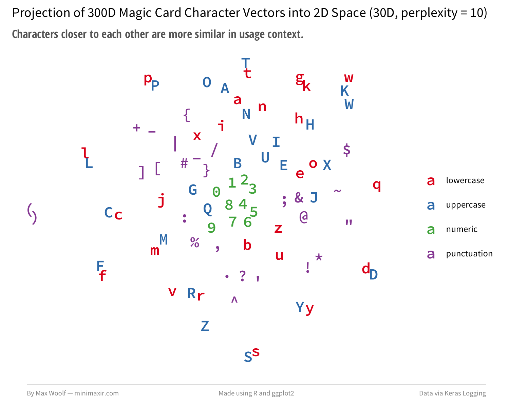

# char-embeddings

**char-embeddings** is a repository containing 300D character embeddings derived from the GloVe 840B/300D dataset, and uses these embeddings to train a deep learning model to generate Magic: The Gathering cards using [Keras](https://keras.io/). The generation and model construction is heavily modified after the [automatic text generation](https://github.com/fchollet/keras/blob/master/examples/lstm_text_generation.py) Keras example by [François Chollet](https://twitter.com/fchollet).

## Usage

This repository contains a number of Python 3 scripts:

- `create_embeddings.py`: Converts a pretrained word embeddings file into a character embeddings file by averaging the per-character vectors.
- `create_magic_text.py`: Converts an MTG JSON card dump into a one-per-line card encoding.
- `text_generator_keras.py`: Constructs and trains the Keras model, producing Magic cards at each epoch.
- `text_generator_keras_sample.py`: Using the text file and Keras model generated from the previous two scripts, generate a large amount of Magic cards.

The `output` folder contains Magic card output at each epoch, a log of losses at every 50th batch, the learned character embeddings at the last epoch, the trained model itself, and a large sample of generated Magic cards.

## Requirements
keras, tensorflow, h5py, scikit-learn

## Maintainer
Max Woolf ([@minimaxir](http://minimaxir.com))

## License
MIT